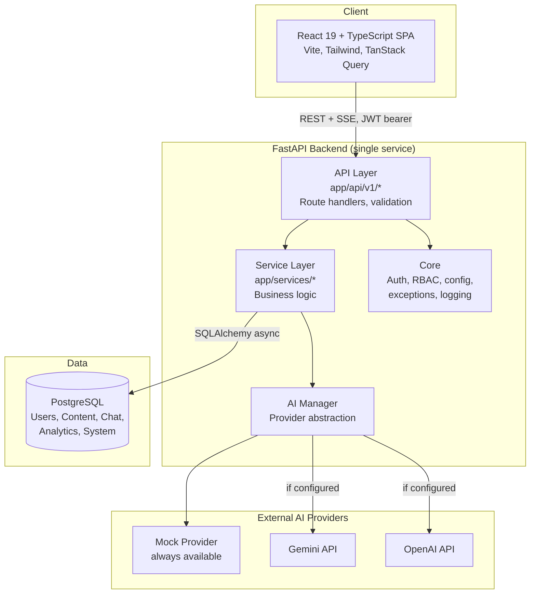

# Architecture Guide

## System overview

COSIB is a modular monolith: a single FastAPI backend serving a REST + SSE
API, paired with a React SPA frontend, backed by PostgreSQL. It's "modular"
in code organization (clean separation between API, services, models) but
deployed as one backend service — appropriate for this scale, and simpler
to operate than microservices would be for a final-year academic project.

## Why these choices

- **FastAPI + async SQLAlchemy**: native async support end-to-end (routes,
  DB sessions, AI provider calls) means the process can handle many
  concurrent chat streams without blocking — important since streaming
  responses hold a connection open for seconds at a time.
- **Provider abstraction (`AIProvider` interface)**: the department can
  switch AI vendors, or add a new one, without touching route code. See
  `app/services/ai_providers/`.
- **Role checks in route signatures (`require_roles`)**: RBAC is explicit
  and grep-able — you can see exactly which roles can hit an endpoint by
  reading its decorator, rather than it being buried in middleware logic.
  See `app/core/permissions.py` for how this could evolve toward granular
  per-user permissions without a route-level rewrite.
- **Knowledge retrieval as a swappable function**: `search_knowledge()` in
  `app/services/knowledge_service.py` does keyword search today, but every
  caller treats it as "give me relevant context for this query" — swapping
  in embeddings/pgvector later doesn't change any caller.
- **React Query for server state**: avoids hand-rolled loading/error state
  management in every component that talks to the API.

## Request lifecycle: a chat message

1. Frontend sends `POST /api/v1/chat/stream` with a JWT bearer token.
2. `get_current_user` dependency validates the token, loads the `User`.
3. `chat_service.prepare_ai_call` persists the user's message, detects the
   knowledge mode (department/academic/campus), searches the knowledge
   base for relevant context, and resolves the active AI provider via
   `AIManager`.
4. The provider streams tokens back; each is forwarded to the client as an
   SSE event as it arrives.
5. Once streaming completes, the full response is persisted as a `Message`,
   an `AnalyticsEvent` is logged, and follow-up suggestions are generated.

## Directory structure

See `docs/FOLDER_STRUCTURE.md` for the full breakdown.

## Where things live conceptually

| Concern | Location |
|---|---|
| Authentication & JWT | `app/core/security.py`, `app/services/auth_service.py` |
| RBAC | `app/core/deps.py` (`require_roles`), `app/core/permissions.py` |
| AI provider abstraction | `app/services/ai_providers/` |
| Prompt construction | `app/services/prompt_engineering.py` |
| Knowledge retrieval | `app/services/knowledge_service.py` |
| Analytics aggregation | `app/services/analytics_service.py` |
| Audit logging | `app/services/audit_service.py` |
| All ORM models | `app/models/` |
| All route handlers | `app/api/v1/` |
