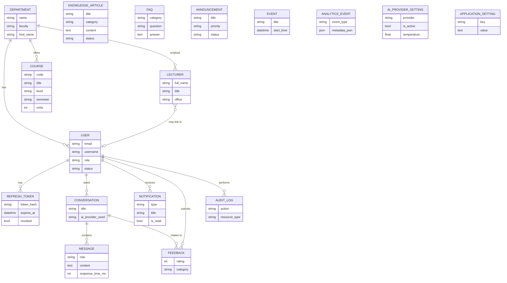
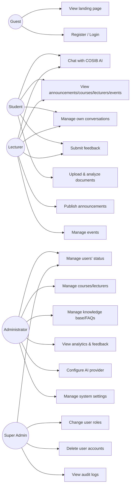
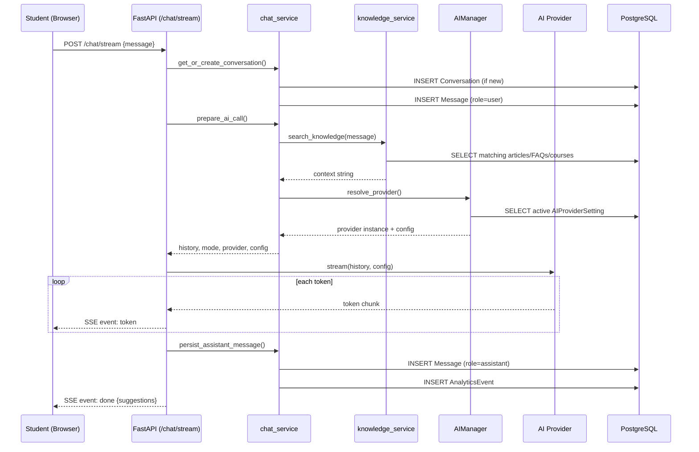
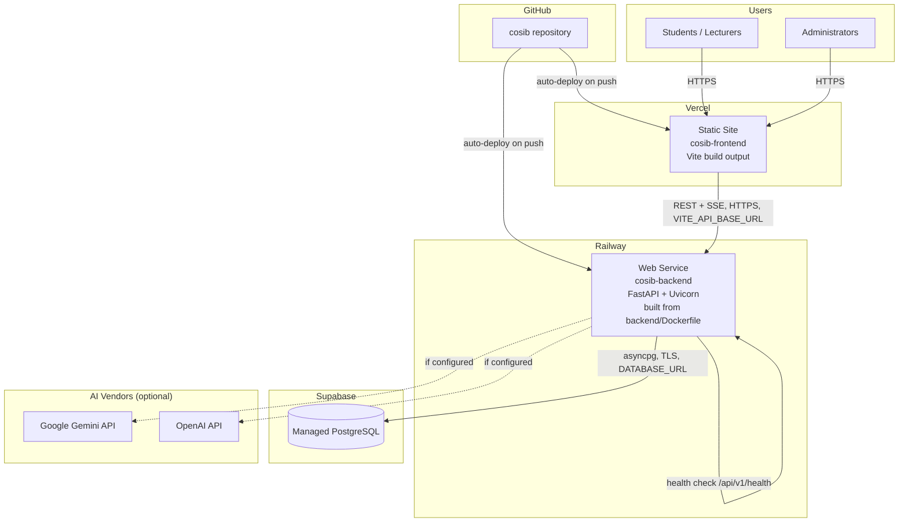

# Diagrams

Rendered as Mermaid — viewable directly on GitHub, or in any Markdown
viewer/IDE with Mermaid support (VS Code with the Markdown Preview Mermaid
extension, Obsidian, etc).

## Entity Relationship Diagram (ERD)

Reflects the actual models in `app/models/` as of ES-005. Every table uses
a UUID primary key and `created_at`/`updated_at` timestamps (via
`UUIDMixin`/`TimestampMixin`), omitted below for readability.

## Use Case Diagram

## Sequence Diagram: Sending a Chat Message (Streaming)

## Deployment Diagram (Vercel + Railway + Supabase)

